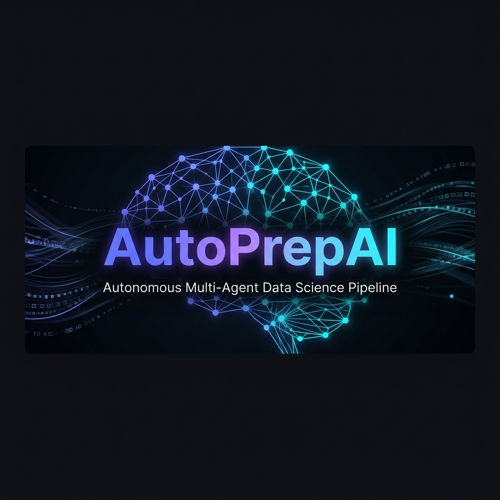
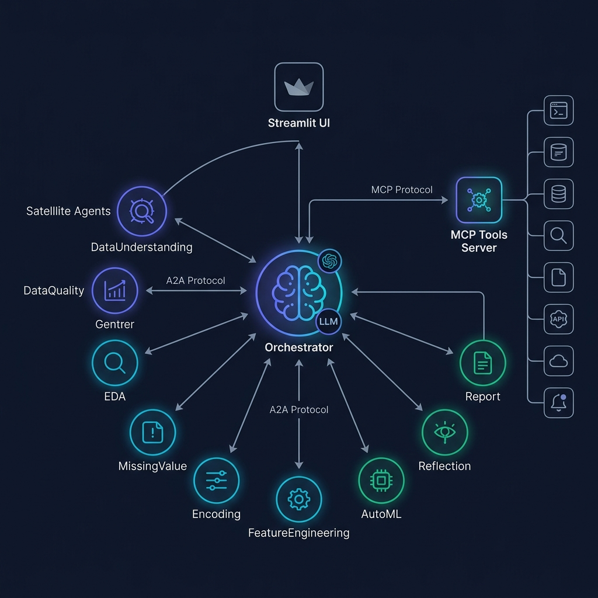
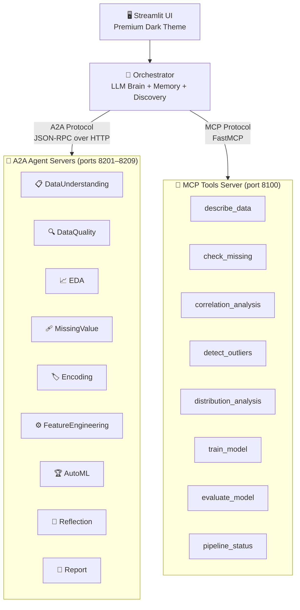
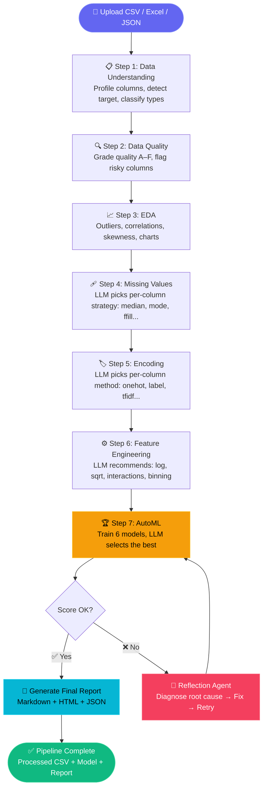
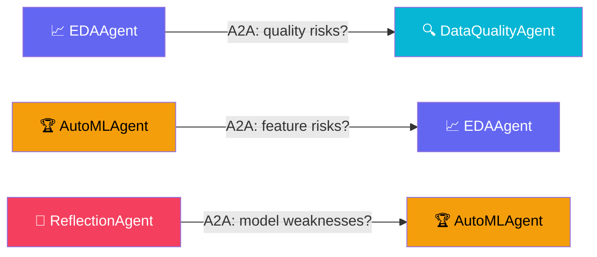

<p align="center">
  
</p>

<h1 align="center">🧠 AutoPrepAI v5</h1>
<h3 align="center">Autonomous Multi-Agent Data Science Pipeline</h3>

<p align="center">
  <em>Upload a dataset → LLM orchestrates 9 agents → Get a trained ML model + full report</em><br>
  <em>100% local • No API keys • Runs on CPU via Ollama llama3.2</em>
</p>

<p align="center">
  
  
  
  
</p>

---

## What is AutoPrepAI?

AutoPrepAI is a fully autonomous data science pipeline where **every decision is made by a local LLM** (Ollama llama3.2). You upload a raw CSV and the system automatically cleans, analyzes, engineers features, trains 6 ML models, and delivers a full explainability report — all without writing a single line of code.

**9 specialized AI agents** communicate through real protocols (A2A + MCP) and are orchestrated by an LLM brain. If model performance is poor, a **Reflection Agent** diagnoses the issue and self-heals the pipeline automatically.

---

## Architecture

<p align="center">
  
</p>



---

## How It Works

The pipeline runs in **7 autonomous stages**. The LLM decides **what** to do — deterministic code (pandas/sklearn) handles execution.



### Agent Collaboration

Agents talk to each other in real-time using the A2A protocol:



### Dataset Versioning

Every successful step saves a snapshot — you can inspect or rollback any stage:

| Stage | File | Description |
|:---:|---|---|
| 0 | `stage_0_raw.csv` | Your original data |
| 3 | `stage_3_missing_fixed.csv` | After imputation |
| 4 | `stage_4_encoded.csv` | After encoding |
| 6 | `stage_6_final.csv` | ML-ready data |
| — | `automl_results.json` | All model metrics |
| — | `eda_report.json` | EDA findings + charts |
| — | `final_report.md` | Report (Markdown) |
| — | `final_report.html` | Report (HTML) |
| — | `pipeline_memory.json` | Full execution log |

---

## How to Run

### Prerequisites

| Tool | Purpose | Install |
|---|---|---|
| **Python 3.10+** | Runtime | [python.org](https://python.org) |
| **Ollama** | Local LLM | [ollama.com](https://ollama.com) |

### Step 1 — Install Dependencies

```bash
git clone https://github.com/yourusername/AutoPrepAI.git
cd AutoPrepAI

python -m venv myenv
myenv\Scripts\activate          # Windows
# source myenv/bin/activate     # Linux/Mac

pip install -r requirements.txt
```

### Step 2 — Setup Ollama

```bash
ollama serve                    # Start Ollama (if not running)
ollama pull llama3.2            # Download model (~2GB, one-time)
```

### Step 3 — Start All Servers

```bash
python start_servers.py
```

> Wait until you see `[OK] 10 servers started successfully`

### Step 4 — Launch the App

```bash
streamlit run app.py
```

Open **http://localhost:8501** → Upload your CSV → Click **"Run Autonomous Pipeline"** → Done! 🎉

---

## Project Structure

```
AutoPrepAI/
├── app.py                      # Streamlit UI
├── orchestrator.py             # LLM orchestrator brain
├── discovery.py                # Dynamic agent/tool discovery
├── memory.py                   # Pipeline memory
├── start_servers.py            # One-command server launcher
├── requirements.txt            # Dependencies
│
├── llm/
│   └── ollama_engine.py        # Ollama LLM engine + Pydantic schemas
│
├── mcp_server/
│   └── server.py               # FastMCP server (8 data tools)
│
├── a2a_agents/
│   ├── base.py                 # Shared agent utilities
│   ├── data_understanding.py   # Dataset profiling
│   ├── data_quality.py         # Quality assessment
│   ├── eda.py                  # EDA + visual charts
│   ├── missing_values.py       # Imputation
│   ├── encoding.py             # Encoding
│   ├── feature_engineering.py  # Feature engineering
│   ├── automl.py               # AutoML + model selection
│   ├── reflection.py           # Self-healing reflection
│   └── report.py               # Explainability report
│
└── workdir/                    # Runtime artifacts (auto-generated)
```

---

<p align="center">
  <strong>Built with 💜 using Ollama • FastMCP • A2A SDK • Streamlit</strong>
</p>
